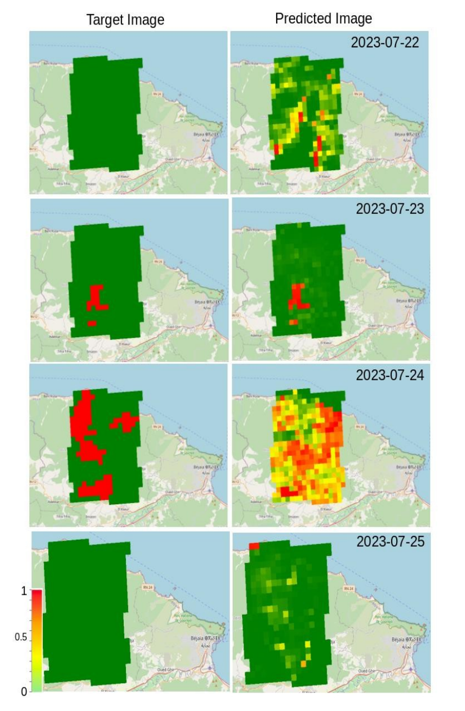

# Algeria_wildfires_prediction:

This repository provides a dataset for the wildfires that occurred in Algeria's northern region between the years 2021 and 2023. The data was extracted from [Google Earth Engine MODIS satellite products](https://developers.google.com/earth-engine/datasets/catalog/MODIS_061_MOD14A1).

## [Datasets](https://github.com/oppenheimer3/Algeria_wildfires_prediction/tree/master/datasets)

This subdirectory houses a diverse array of datasets related to wildfires in Algeria:

1. **Algeia_wildfires_dataset.csv**
   - *Description:* The primary dataset encompassing all recorded wildfires in Algeria from 2021 to 2023.
   - *Source:* [MODIS_061_MOD14A1 - Google Earth Engine](https://developers.google.com/earth-engine/datasets/catalog/MODIS_061_MOD14A1#bands)

2. **land_surface_temperature.csv**
   - *Description:* This dataset provides information about land surface temperatures associated with the recorded wildfires.
   - *Source:* [MODIS_061_MOD11A1 - Google Earth Engine](https://developers.google.com/earth-engine/datasets/catalog/MODIS_061_MOD11A1#bands)

3. **soil_moisture.csv**
   - *Description:* This dataset contains information regarding soil moisture levels corresponding to the wildfires.
   - *Source:* [NASA_SMAP_SPL4SMGP_007 - Google Earth Engine](https://developers.google.com/earth-engine/datasets/catalog/NASA_SMAP_SPL4SMGP_007#bands)

4. **vegetation.csv**
   - *Description:* This dataset offers insights into vegetation indices associated with the wildfires.
   - *Source:* [MODIS_061_MOD13A2 - Google Earth Engine](https://developers.google.com/earth-engine/datasets/catalog/MODIS_061_MOD13A2#bands)

5. **surface_reflectance.csv**
   - *Description:* This dataset provides information about surface reflectance bands related to the wildfires.
   - *Source:* [MODIS_061_MOD09GQ - Google Earth Engine](https://developers.google.com/earth-engine/datasets/catalog/MODIS_061_MOD09GQ#bands)

6. **wildfires_2021.csv and wildfires_2023.csv**
   - *Description:* These datasets contain details about the provinces and towns where wildfires occurred in 2021 and 2023, respectively.

7. **total_dataset.csv**
   - *Description:* The default dataset, representing the consolidated information from all the other datasets.

8. **make_wildfire_dataset.ipynb**
   - *Description:* This Jupyter Notebook provides a guide for creating your custom wildfire dataset, which is akin to the primary dataset. Use it to tailor the dataset to your specific requirements.

Please note that for detailed information and specific data attributes, you can refer to the provided source links for each dataset.

## Example
You can also find a simple use case in the [Jupyter notebook](https://github.com/oppenheimer3/Algeria_wildfires_prediction/blob/master/model.ipynb) where a neural network is developed to predict the risk of wildfire occurrence:

Performance Evaluation of the Trained Model on the Bejaia Wildfires 2023 Test Set, where the colors represent the probability of occurrence.